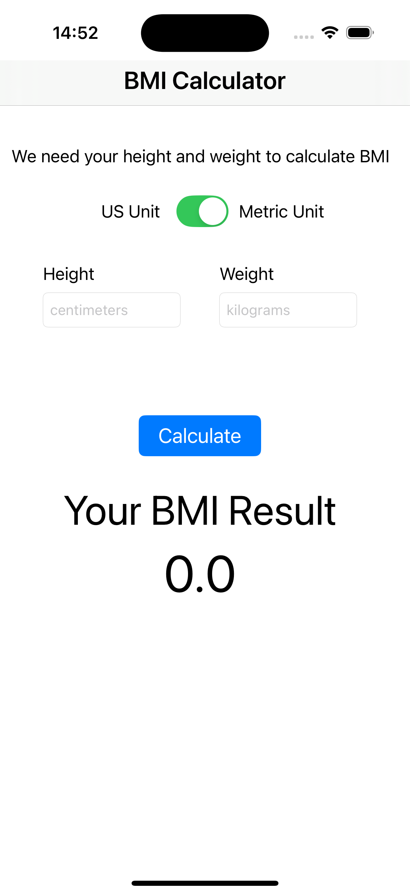
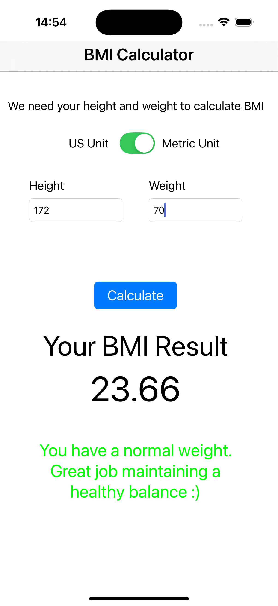
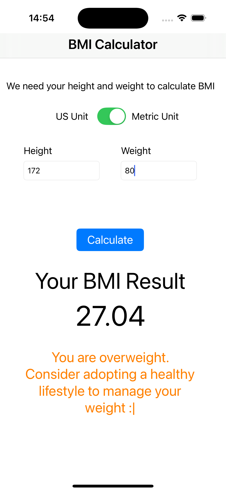
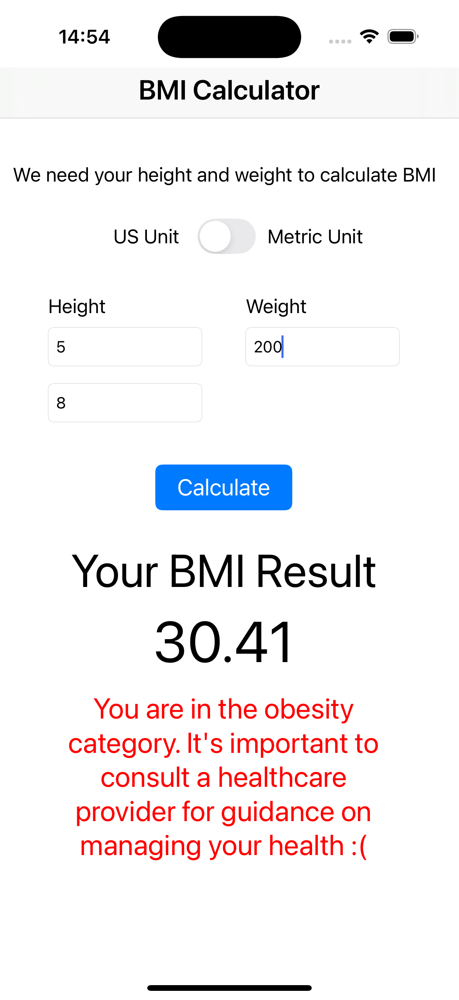
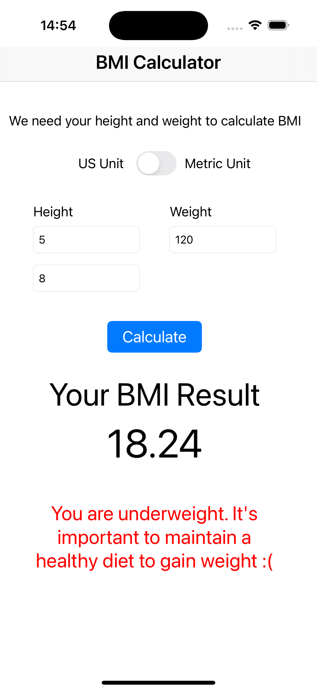
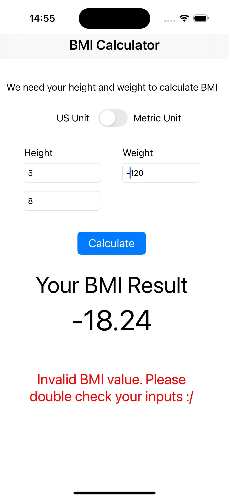

# BMI Calculator App
This app allows users to calculate their Body Mass Index (BMI) based on two measurement systems: the SI (metric) system and the Imperial system. The app calculates BMI by taking the user's weight and height as inputs, then classifies the result into a BMI category (e.g., underweight, normal weight, overweight, or obesity).

# Installation
- Clone the repository: `git clone https://github.com/r-sachdeva3105/bmi-calculator-ios.git`
- Open the project in Xcode (or Android Studio for a cross-platform app).
- Build and run the app on a simulator or physical device.

# Screenshots

  
  
  
  
  
  

# Demo
